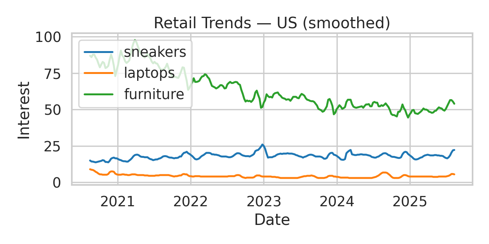
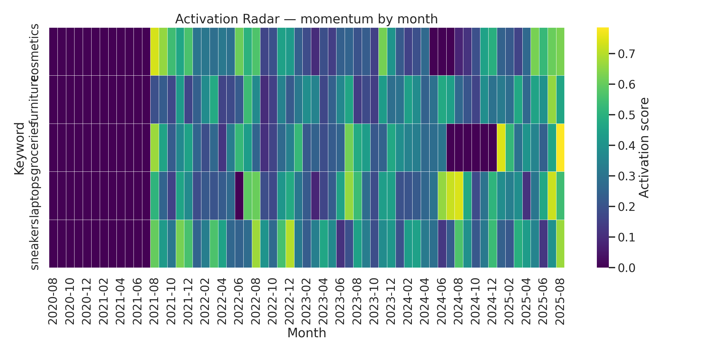

# Retail-Trend-Activation-Radar

## What’s inside
- **CLI:** `src/radar_cli.py` — one command regenerates CSV, Excel, and PNG previews.
- **Notebooks (explorable):**
  - `notebooks/01_signal_ingest.ipynb` — pulls Google Trends, engineers MA / YoY / z-score features, saves sample Excel.
  - `notebooks/02_activation_windows.ipynb` — monthly scoring, **Activation Radar** heatmap, **Top Months** table.
- **Preview charts:**
  - 
  - 

---

## Inputs (signals)
- **Source:** Google Trends weekly interest via `pytrends` for a keyword list (e.g., `sneakers`, `laptops`).
- **Features:** moving average (smoothing), **YoY index** (vs. 52-week lag), **rolling z-score** (momentum).
- **You control:**  
  `--geo` (e.g., `US`, `MX`) • `--keywords` (comma-separated) • `--timeframe` (e.g., `"today 5-y"`)

---

## Output (stakeholder-ready)
**Excel:** `reports/activation_radar.xlsx`  
Sheets:
- `Signals_preview` — sample of engineered features
- `Activation_Radar` — per keyword × month aggregates + `act_score`
- `Top_Months` — top 3 months per keyword (score, YoY, z, heat share)

**PNGs:** `assets/trends_preview.png`, `assets/activation_radar.png`

**Score formula**

act_score = 0.6 * z_scaled + 0.3 * yoy_scaled + 0.1 * hot_share

- `hot_share` = fraction of days with `z ≥ 1.2`  
- `z_scaled` / `yoy_scaled` are min-max scaled within the table

---

## Run the notebooks (optional)
Use the same virtual environment as the CLI.

1. Open `notebooks/01_signal_ingest.ipynb` and select this repo’s `.venv` as kernel.  
2. **Run All** → generates:
   - `data/trends_signals.csv`
   - `reports/sample_activation_radar.xlsx`
   - `assets/trends_preview.png`
3. Open `notebooks/02_activation_windows.ipynb` and **Run All** → adds:
   - `assets/activation_radar.png`
   - updates Excel with `Activation_Radar` and `Top_Months`

---

## Repository structure

data/
└── trends_signals.csv # tidy signals (auto-generated)
notebooks/
├── 01_signal_ingest.ipynb
└── 02_activation_windows.ipynb
assets/
├── trends_preview.png
└── activation_radar.png
reports/
├── sample_activation_radar.xlsx
└── activation_radar.xlsx # from CLI run
src/
└── radar_cli.py # one-command generator (CSV, Excel, PNGs)
README.md

---

## Parameters (CLI)
```bash
python -m src.radar_cli \
  --geo US \
  --keywords sneakers,laptops,furniture,cosmetics,groceries \
  --timeframe "today 5-y" \
  --out reports/activation_radar.xlsx

- geo: 2-letter country/region code
- keywords: comma-separated list (batching handled under the hood)
- timeframe: Google Trends window (e.g., now 7-d, today 12-m, today 5-y)
- out: Excel path (created/overwritten)
```

---

## Interpretation guide

- Activation_Radar heatmap: brighter cells = higher momentum (seasonal + current heat).
- Top_Months: where to focus activation budget/merch for each category.
- Pair with business context (promo calendar, supply, margin) for final decisions.
- Use absolute + relative comparisons across categories to prioritize spend.

---

## Troubleshooting
- Old kernel warning: you can proceed; upgrading to Python 3.12 removes the notice.
- xlsxwriter append error: CLI overwrites workbook; in notebooks, appends use openpyxl.
- Empty/partial data from pytrends: reduce keyword count, try different --timeframe, or increase sleep between payloads.
- Images don’t render in README: confirm assets/trends_preview.png and assets/activation_radar.png exist and are committed; hard refresh GitHub.
